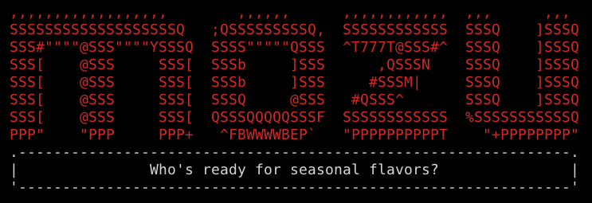

# mosay 

> Tell Mozu what to say.

Like [cowsay](http://en.wikipedia.org/wiki/Cowsay), but less cow, and like [yosay](https://github.com/yeoman/yosay) but with more stylized M and less Wes Anderson character.




## Install

```sh
$ npm install --save mosay
```


## Usage

```js
var mosay = require('mosay');

console.log(mosay('Follow the prompts to scaffold a Mozu Extension package.' +
'You\'ll get a directory structure, action file skeletons, and a test framework!'));
/*

 ,,,,,,,,,,,,,,,,,,        ,,,,,,      ,,,,,,,,,,,,  ,,,      ,,, 
 SSSSSSSSSSSSSSSSSSSQ   ;QSSSSSSSSSQ,  SSSSSSSSSSSS  SSSQ    ]SSSQ
 SSS#""""@SSS""""YSSSQ  SSSS"""""QSSS  ^T777T@SSS#^  SSSQ    ]SSSQ
 SSS[    @SSS     SSS[  SSSb     ]SSS      ,QSSSN    SSSQ    ]SSSQ
 SSS[    @SSS     SSS[  SSSb     ]SSS     #SSSM|     SSSQ    ]SSSQ
 SSS[    @SSS     SSS[  SSSQ     @SSS   #QSSS^       SSSQ    ]SSSQ
 SSS[    @SSS     SSS[  QSSSQQQQQSSSF  SSSSSSSSSSSS  %SSSSSSSSSSSQ
 PPP"    "PPP     PPP+   ^FBWWWWBEP`   "PPPPPPPPPPT    "+PPPPPPPP"
 .---------------------------------------------------------------.
 |    Follow the prompts to scaffold a Mozu Extension package.   |
 |  You'll get a directory structure, action file skeletons, and |
 |                       a test framework!                       |
 '---------------------------------------------------------------'

*/
```

*You can style your text with [chalk](https://github.com/sindresorhus/chalk) before passing it to `mosay`.*


## CLI

```
$ npm install --global mosay
```

```
$ mosay --help

  Say it loud. Say it with a large Mozu logo.

  Usage
    mosay <string>
    mosay <string> --maxLength 8
    echo <string> | mosay

  Example
    mosay "Who's ready for seasonal flavors?!"

 ,,,,,,,,,,,,,,,,,,        ,,,,,,      ,,,,,,,,,,,,  ,,,      ,,, 
 SSSSSSSSSSSSSSSSSSSQ   ;QSSSSSSSSSQ,  SSSSSSSSSSSS  SSSQ    ]SSSQ
 SSS#""""@SSS""""YSSSQ  SSSS"""""QSSS  ^T777T@SSS#^  SSSQ    ]SSSQ
 SSS[    @SSS     SSS[  SSSb     ]SSS      ,QSSSN    SSSQ    ]SSSQ
 SSS[    @SSS     SSS[  SSSb     ]SSS     #SSSM|     SSSQ    ]SSSQ
 SSS[    @SSS     SSS[  SSSQ     @SSS   #QSSS^       SSSQ    ]SSSQ
 SSS[    @SSS     SSS[  QSSSQQQQQSSSF  SSSSSSSSSSSS  %SSSSSSSSSSSQ
 PPP"    "PPP     PPP+   ^FBWWWWBEP`   "PPPPPPPPPPT    "+PPPPPPPP"
 .---------------------------------------------------------------.
 |               Who's ready for seasonal flavors?               |
 '---------------------------------------------------------------'

```


## License

[BSD license](http://opensource.org/licenses/bsd-license.php)
Copyright (c) Google
